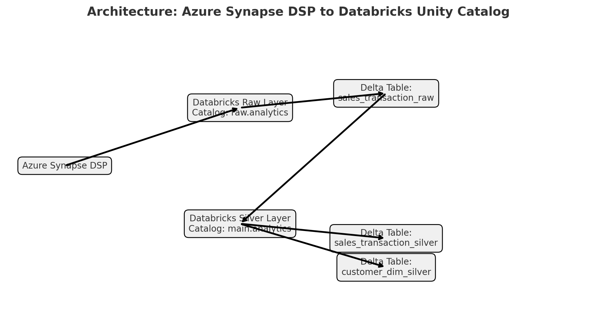

# Project: Azure Synapse DSP to Databricks Unity Catalog

## 📌 Objective

Migrate data from Azure Synapse Dedicated SQL Pool (DSP) to Databricks Unity Catalog using a structured Delta Lake approach with **raw** and **silver** layers.

---

## 📂 Project Structure

```
AzureSynapse_To_Databricks_Migration/
│
├── data/                           # Simulated 100MB+ realistic data
│   ├── sales_transactions.csv
│   └── customer_data.csv
│
├── notebooks/                      # PySpark scripts
│   ├── 01_dsp_read_to_raw.py
│   ├── 02_clean_transform_join.py
│   └── utils.py
│
├── catalog/                        # SQL schema definition for DSP
│   └── schema_definition.sql
│
├── architecture.png                # Visual pipeline diagram
├── README.md                       # This file
└── requirements.txt
```

---

## 🧠 Why Migrate to Databricks?

| Feature                  | Synapse DSP       | Databricks Lakehouse    |
|--------------------------|-------------------|--------------------------|
| Compute Flexibility      | Fixed DWU         | Auto-scale clusters      |
| Data Format Support      | Tabular only      | Delta, Parquet, CSV, etc |
| Streaming Support        | Limited           | Built-in Streaming       |
| Cost Efficiency          | High on idle DSP  | Pay-per-use              |
| ML & Data Science        | Separate services | Native to workspace      |
| Catalog Management       | Basic             | Unity Catalog w/ RBAC    |

---

## 🔧 Processing Steps

### Step 1: Read from Synapse DSP → Raw Layer
- Ingest data using JDBC from DSP
- Store in Unity Catalog: `raw.analytics.sales_transaction_raw`

### Step 2: Clean & Transform → Silver Layer
- Normalize strings, handle nulls, correct types
- Join with `customer_data.csv`
- Derive `NetAmount` after discount
- Write to: `main.analytics.sales_transaction_silver`

---

## 🧪 Data Preview

**Sales Transactions (100,000 rows)**  
Columns: `TransactionID`, `CustomerID`, `TransactionDate`, `Region`, `ProductCategory`, `Amount`, `PaymentMode`, `DeliveryStatus`, `Rating`, `CustomerFeedback`, ...

**Customer Data (5,000 rows)**  
Columns: `CustomerID`, `CustomerName`, `Email`, `Country`, `SignupDate`, `Status`, `PreferredChannel`, ...

---

## 🖼️ Architecture



---

## 🔌 Connections & Config

Update `jdbc_url`, `user`, and `password` in:
```python
notebooks/01_dsp_read_to_raw.py
notebooks/utils.py
```

---

## ✅ Output Tables

| Layer   | Catalog  | Schema    | Table                            |
|---------|----------|-----------|----------------------------------|
| Raw     | raw      | analytics | sales_transaction_raw           |
| Silver  | main     | analytics | sales_transaction_silver        |
